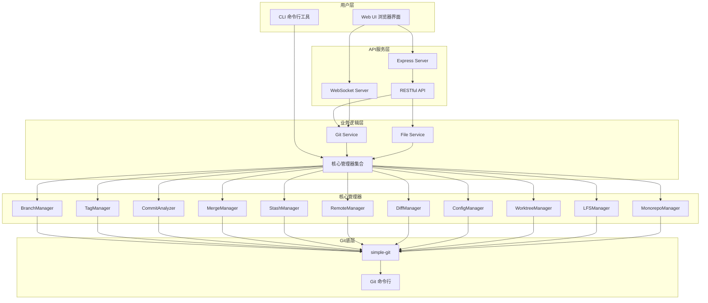
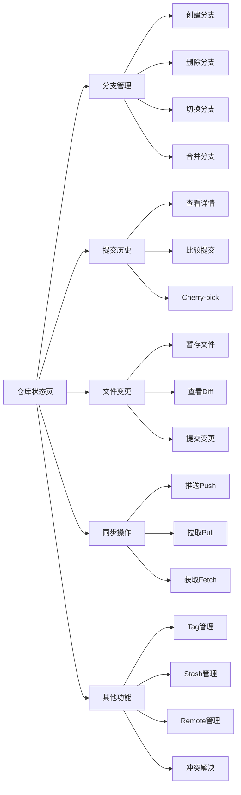
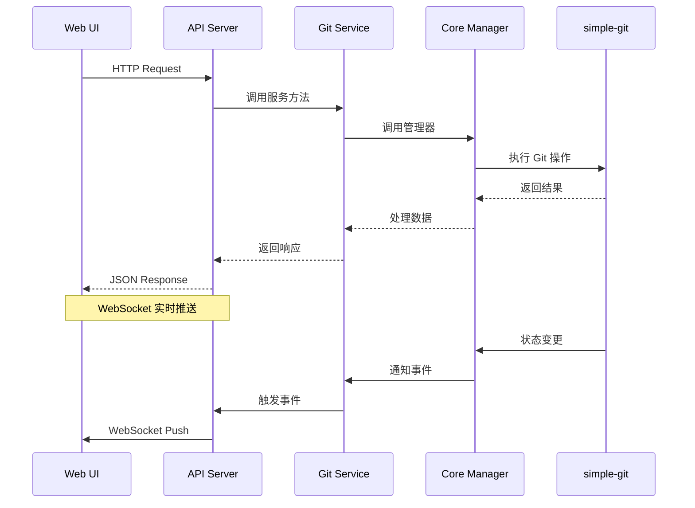
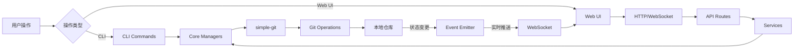

# @ldesign/git 系统架构图

## 整体架构



## Web UI 页面流程



## API 请求流程



## 数据流向



## 组件关系图

```mermaid
graph TB
    subgraph Web UI Components
        Layout[MainLayout]
        Layout --> Sidebar[Sidebar]
        Layout --> Content[Content Area]
        
        Content --> Status[Status Page]
        Content --> Branch[Branch Page]
        Content --> Commit[Commit Page]
        Content --> Files[Files Page]
        Content --> Sync[Sync Page]
        
        Status --> StatusCard[Status Card]
        Status --> QuickAction[Quick Actions]
        
        Branch --> BranchList[Branch List]
        Branch --> BranchOps[Branch Operations]
        
        Commit --> CommitList[Commit List]
        Commit --> CommitDetail[Commit Detail]
        
        Files --> FileTree[File Tree]
        Files --> DiffViewer[Diff Viewer]
    end
    
    subgraph State Management
        Store[Zustand Store]
        Store --> RepoState[Repo State]
        Store --> BranchState[Branch State]
        Store --> FileState[File State]
    end
    
    subgraph Services
        API[API Service]
        WS[WebSocket Service]
    end
    
    Layout --> Store
    Status --> Store
    Branch --> Store
    Commit --> Store
    Files --> Store
    
    Store --> API
    Store --> WS